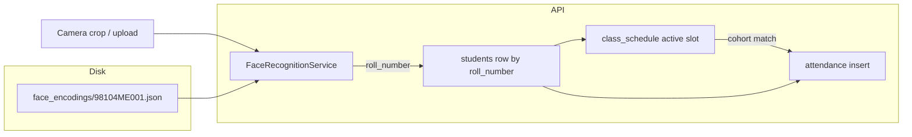

# What all tables mean (CrowdMuse DB)

This is the mental model for the SQLite schema in `app/models.py`, plus how **face recognition** ties in. The API decides “who should be in this class right now?” from **cohort** (program + batch year), not from a separate enrollment row per timetable slot.

**Default database file (running the API):** `backend/data/crowdmuse.sqlite3` — see `app/db.py` (`DATA_DIR`, `DB_PATH`). **`scripts/seed_sample_db.py`** writes a separate file, **`backend/data/sample_crowdmuse.sqlite3`**, for demos and does not replace the default DB unless you point the app at it yourself.

**The `students` table is part of this schema** — it is not missing. It stores identity, cohort, and an optional photo path. **Face matching** uses a separate on-disk file per student, keyed by the same **`roll_number`** as in `students`.

---

## Example rows (toy data)

These illustrate how IDs line up. Values are illustrative; your real DB will differ.

### `streams`

| id | name |
|----|------|
| 1 | Mechanical Engineering |
| 2 | Computer Science |

### `students`

| id | roll_number | name | stream_id | batch_year | photo_path |
|----|-------------|------|-----------|------------|------------|
| 1 | `98104ME001` | Arjun Patel | 1 | 2025 | `uploads/98104ME001.jpg` (optional) |
| 2 | `98204CS001` | Priya Nair | 2 | 2025 | `NULL` |

Cohort = **`stream_id` + `batch_year`**. Arjun is “ME, 2025 batch”; Priya is “CS, 2025 batch”.

### `class_schedule`

| id | stream_id | batch_year | day_of_week | start_time | end_time | room | course_code | class_name |
|----|-----------|------------|-------------|------------|----------|------|-------------|------------|
| 1 | 1 | 2025 | 0 (Mon) | 09:00 | 10:00 | 321 | M3101 | Engineering Thermodynamics |
| 2 | 1 | 2025 | 0 (Mon) | 10:00 | 11:00 | 213 | S1234 | Applied Mathematics |

Same program and batch as Arjun → he is eligible for both rows on Mondays when time and room match.

### `attendance`

| id | student_id | room | class_name | status | date_key | marked_at |
|----|------------|------|------------|--------|----------|-----------|
| 1 | 1 | 321 | Engineering Thermodynamics | present | 2026-04-07 | (server local timestamp) |

Links to Arjun via **`student_id`**. `class_name` matches the active slot’s **`class_name`** when marking through scheduled endpoints. For **`mark-scheduled`** / **`mark-by-face-scheduled`**, **`date_key`** is the **calendar date of the same instant** used to resolve the timetable (server `datetime.now()`, or optional `at` on the JSON body), not a separate `date.today()` call.

---

## Big picture

1. **`streams`** — Branch/program (e.g. Mechanical Engineering).
2. **`students`** — Person + **cohort** (`stream_id`, `batch_year`) + optional `photo_path`.
3. **`class_schedule`** — Weekly timetable row for a cohort: time, room, course, labels.
4. **`attendance`** — Mark: which **student**, which **room** + **class label**, which **day**, **status**.

There is **no** `enrollments` table. Eligibility = student’s `stream_id` and `batch_year` equal the slot’s `stream_id` and `batch_year`.

---

## How tables connect

```
                    streams
                   (id, name)
                        │
          ┌─────────────┴─────────────┐
          ▼                             ▼
     students                    class_schedule
 (id, roll_number,              (stream_id, batch_year,
  stream_id, batch_year)         day_of_week, times,
          │                      room, course_code, class_name)
          │
          │   eligibility: same stream_id + batch_year as slot
          │
          ▼
     attendance
 (id, student_id → students.id,
  room, class_name, date_key, status, marked_at, …)
```

**Eligibility for a slot:**  
`student.stream_id == class_schedule.stream_id` **and** `student.batch_year == class_schedule.batch_year`.

**Active slot for a room (server local clock):**  
Filter `class_schedule` by `room`, the **`when` instant’s** `day_of_week`, and clock time in **`[start_time, end_time)`** (see `app/timetable.py`).

**Note:** **`attendance_window`** and **`late_window`** (minutes on each slot) are **not** used to pick the active row on the server. They are stored and returned by the API for **client-side** grace/late logic (e.g. `mark_attendance.py`).

---

## Students and face images (not a separate “face table”)

Recognition does **not** read a BLOB from SQLite for matching. The chain is:

| Piece | Where it lives | Role |
|--------|----------------|------|
| **Identity in DB** | `students.roll_number`, `students.name`, cohort | Source of truth for “who exists” and “which class they belong to.” |
| **Optional source photo** | `students.photo_path` | Optional path to an enrollment/reference image (human convenience / future use). The API does not require it for `mark-by-face`. |
| **What the matcher uses** | `data/face_encodings/<roll_number>.json` | `FaceRecognitionService` loads all `*.json` files; the **filename stem** must equal **`students.roll_number`**. Inside: numeric face vector(s) + optional `name`. |

So the **link between “face” and “student row”** is: **same `roll_number`** in `students` and in the encoding filename (`98104ME001.json` ↔ roll `98104ME001`).

Enrollment scripts (e.g. `enroll_student.py`) typically: **create the `students` row via API**, then **compute encoding from camera/photo** and call `save_encoding(roll_number, ...)`, which writes that JSON file.

---

## Marking attendance (summary)

| Endpoint | How `class_name` is chosen | Timetable? | Typical `date_key` |
|----------|----------------------------|------------|--------------------|
| `POST /attendance/mark` | Client sends it | No | Server local calendar date when marking (`date.today()` in handler) |
| `POST /attendance/mark-scheduled` | From active slot | Yes (`room` + optional `at`, default now) | Calendar date of that same instant |
| `POST /attendance/mark-by-face` | Client sends it | No | Same as `mark` |
| `POST /attendance/mark-by-face-scheduled` | From active slot | Yes (`room` + `datetime.now()` after face match) | Calendar date of that same instant |

---

## Marking attendance with `FaceRecognitionService`

**Face upload** endpoints below; **`mark-scheduled`** (JSON, no image) uses the same timetable + cohort rules as **`mark-by-face-scheduled`**.

### 1. `POST /attendance/mark-by-face` (manual class context)

1. Client sends **image bytes** + **room** + **class_name** (form fields).
2. `FaceRecognitionService.recognize_face_from_image_bytes` encodes the face and **`match_encoding`** finds the closest stored encoding → returns **`(roll_number, confidence)`**.
3. API loads **`Student` by `roll_number`**, then calls the same logic as roll-based mark: insert **`attendance`** (`student_id`, `room`, `class_name`, `date_key`, …).

**DB touch:** `students` (lookup by roll) → `attendance` insert. **Timetable is not used.**

### 2. `POST /attendance/mark-by-face-scheduled` (timetable + cohort)

1. Same as above: image → **`roll_number`** via encodings.
2. Load **`Student`** by `roll_number`.
3. Set **`when = datetime.now()`** (server local). **`resolve_student_scheduled_attendance(db, student, room, when=when)`** calls **`get_active_schedule_for_room`** for that room and instant, then checks cohort.
4. If the slot matches, persist via **`_persist_attendance_mark`** with **`class_name` from the slot**, **`date_key = when.date().isoformat()`**, and **`marked_at`** set at persist time.

**DB touch:** encodings (disk) → `students` → `class_schedule` (read) → `attendance` (write).

### 3. `POST /attendance/mark-scheduled` (roll + room, no face)

Same as (2) but **`roll_number`** comes from JSON. Optional **`at`** datetime: if omitted, **`when`** defaults to **`datetime.now()`**; timezone-aware values are converted to **naive local** before comparing to the timetable. **`date_key`** is always **`when.date().isoformat()`** for that request.

Diagram below: **face** path only (`mark-scheduled` skips face recognition and starts from the known `roll_number`).



---

## Table reference (columns)

### `streams`

- **`id`**, **`name`** (unique) — program/branch.

### `students`

- **`id`**, **`roll_number`** (unique), **`name`**
- **`stream_id`** (FK → `streams.id`), **`batch_year`** — cohort
- **`photo_path`** — optional path to an image file
- **`created_at`**

### `class_schedule`

- **`id`** (PK), **`stream_id`** (FK → `streams.id`), **`batch_year`**
- **`room`**, **`course_code`**, **`class_name`**
- **`day_of_week`** (0 = Monday … 6 = Sunday)
- **`start_time`**, **`end_time`** (`HH:MM`) — used by the server for active-slot resolution
- **`attendance_window`**, **`late_window`** (minutes; stored for clients / tooling; not used by server slot lookup)

### `attendance`

- **`student_id`** (FK → `students.id`)
- **`room`**, **`class_name`**, **`status`**, **`date_key`** (`YYYY-MM-DD`), **`marked_at`**
- Optional **`lat`**, **`lng`**
- Unique on **`(student_id, date_key, room, class_name)`** — idempotent re-mark for the same session

---

## Sample database file

`scripts/seed_sample_db.py` creates **`data/sample_crowdmuse.sqlite3`** with more rows. It does **not** create `face_encodings/*.json`; for a full face flow you still enroll faces so **`roll_number` in DB** matches **encoding filenames**.
